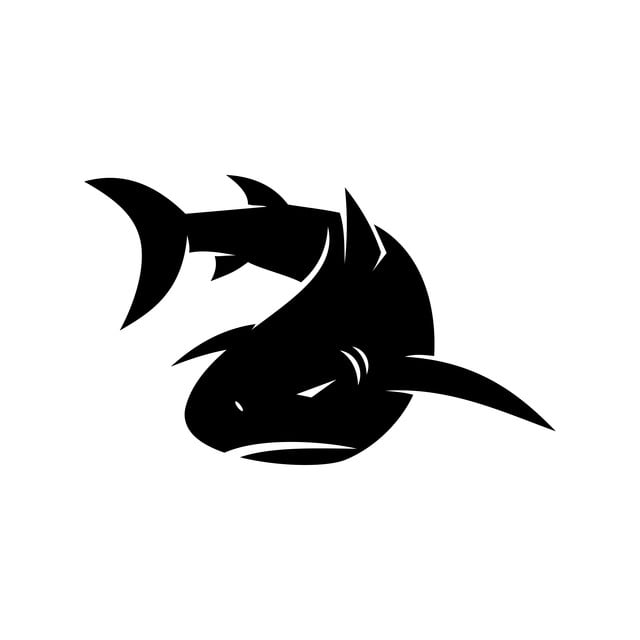

Megladon: The Protoss Starcraft 2 Shark AI!
===========================================

  

Megladon is a hyper-aggressive protoss starcraft 2 ai that will be playing in the ai battle arena. Megladon will exhibit shark like behaviour incorporated into it's starcraft 2 play.  

Announcements
=============

-   Work has began! March 2020

Using Megladon
=====================

Megladon will be my starcraft 2 ai that will be publically avaliable for people to use freely in building their AI. As the project evolves and the megladon gains more power and success certain features of the bot will be non-disclosed (I expect it to go pro - high expectations for my bot). 

Megladon's goals:

- Become a grandmaster of the protoss race

Installation 
============

Megladon will be running primarily with python 3.5+. As for now if you want to submit any PRs then please clone/fork this repository and follow the contribution guidelines. 

The project will be under heavy development as I find the time to code it (response may be slow). 

    git clone https://github.com/Sulstice/Cocktail-Shaker.git

Structure of Megladon
=====================

Currently, the main subpackages are:

-   **megladon**: starcraft 2 main ai package 

Genesis
=======

Megladon has started because I needed projects away from life sciences.

- Lead Developer [Suliman sharif](http://sulstice.github.io/)

* * * * *

External links
==============

